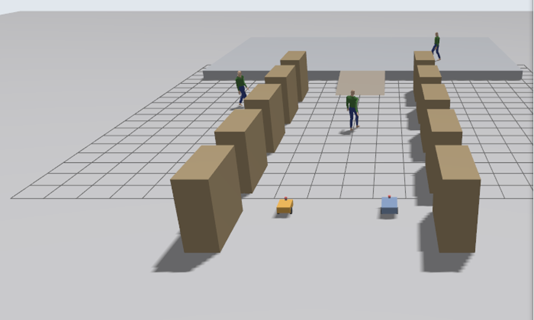
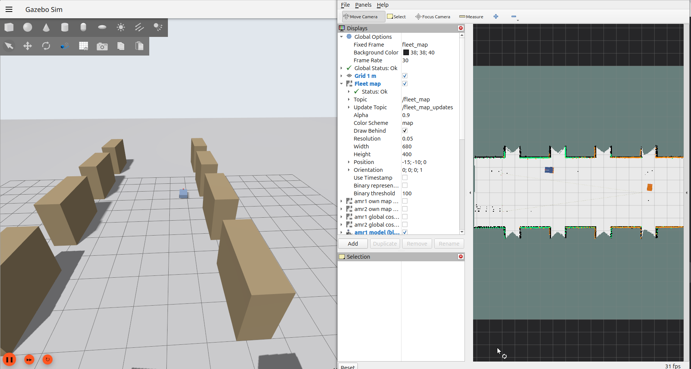
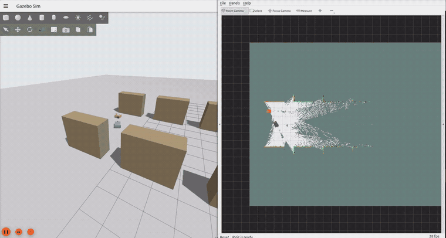
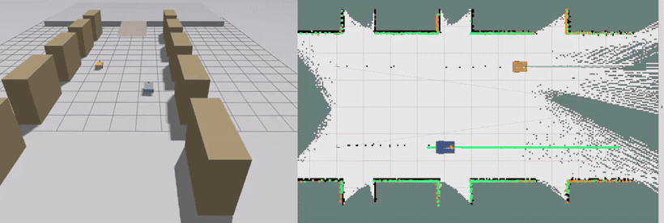
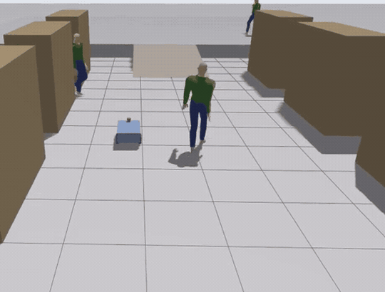
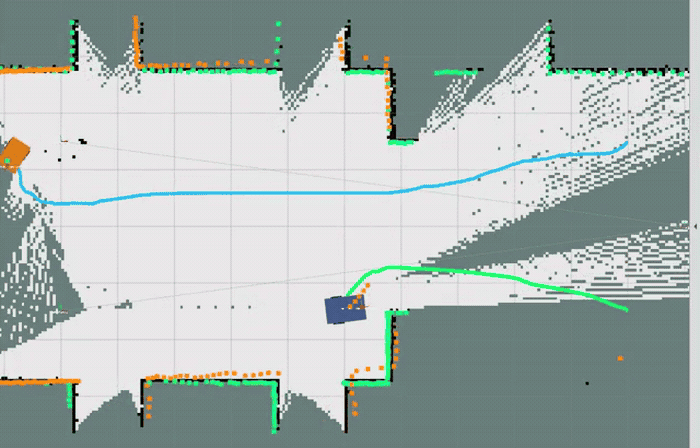

# How to Run — the evaluator's guide

Everything you need, in order. Each demo below tells you the **exact command**, what
**Gazebo** and **RViz** should show, how you know it **worked**, and what to check if
it did not.

- Per-scenario detail: [`docs/DEMO_RUNBOOK.md`](docs/DEMO_RUNBOOK.md)
- What was built and what was measured: [`README.md`](README.md)
- **Read [§9 Known failures](#9-known-failures-read-before-judging) before judging.**
  What is partial or undemonstrated is listed there rather than left for you to find.

---

## 1. What you need

| | |
|---|---|
| OS | Ubuntu 24.04 |
| ROS | ROS 2 **Jazzy** |
| Simulator | Gazebo **Harmonic** (`gz-sim` 8) |
| Also | Nav2, `slam_toolbox`, `colcon`, `rviz2` |

Nothing else to install beyond dependencies.

---

## 2. Set up — four commands

```bash
git clone https://github.com/GauthamCodes/amr-fleet-nav.git
cd amr-fleet-nav
rosdep install --from-paths src --ignore-src -r -y
./ws.sh colcon build --symlink-install
```

**Expect:** `Summary: 9 packages finished`, **0 errors**. `setuptools` deprecation
warnings on stderr are normal.

```bash
./ws.sh python3 -m pytest tests/ -q      # expect: 241 passed
```

> ### If you already cloned this repo before, `git pull` is not enough
>
> **You must rebuild after pulling.** The launch files, the RViz configuration and
> the mission scripts all live in the `install/` tree, and a stale `install/` is
> indistinguishable from a broken project: `rviz:=true` is silently ignored, RViz
> never appears, and starting it by hand gives you an empty window. If a demo
> below does not behave as described, run this first:
>
> ```bash
> git pull
> ./ws.sh colcon build --symlink-install
> ```

### What is `./ws.sh`?

A wrapper every command here uses. It sources ROS and this workspace, points Gazebo
at the world files, and raises a CycloneDDS participant limit. **Use it for
everything, including `rviz2`.** Without it, the second robot's navigation servers
die with `Failed to find a free participant index for domain 0` — which looks like a
bug in the robot and is only the missing wrapper.

---

## 3. Before every demo

```bash
./scripts/clean_processes.sh
```

Wait for:

```
PROCESS TABLE CLEAN - nothing matching a simulation or ROS pattern is running
```

A leftover process from a previous run quietly corrupts the next one — including a
stale RViz window, which keeps showing the *previous* run while the new one comes up
and looks exactly like the new run being broken. The script closes RViz too.

> **Do not type `pkill -f rviz2` at a prompt.** `-f` matches the whole command line,
> your command line contains the pattern, so the shell matches *itself* and dies
> before RViz is touched. If you ever need to do this by hand, use `pkill -x rviz2`.

> **Nothing appears for the first ~30 seconds of any demo.** Startup is staged:
> robots spawn, then sensor validation, then SLAM, then the shared map, then
> navigation. Wait 45 s before concluding anything has hung.

---

## 4. Reading these demos

Every demo below is one command. Where a demo writes a report, it is given
`tag:=demo` so **your run cannot overwrite the committed evidence** in `results/`.

RViz, where it is used, starts automatically with the correct configuration. You do
not need to open it yourself.

---

### What a working run looks like

Every image and clip on this page was captured from a run of the command printed
beside it, on the code in this repository. Nothing is a mock-up, and nothing is from
an older build.

| | |
|---|---|
|  | **The warehouse.** Rack rows either side, the 8° ramp and upper plateau beyond, three walking pedestrians, and **both robots in the aisle** — AMR-2 amber on the left, AMR-1 blue on the right. This is what Gazebo should open to. |
|  | **What to check in RViz**, with the Displays panel open: **Fixed Frame `fleet_map`**, `Global Status: Ok`, topic **`/fleet_map`**, 0.05 m resolution, **680 × 400**, origin −15 / −10. If your Fixed Frame says `map` you will get an empty window — that frame does not exist here (§5). |

---

## Demo A — Cooperative mapping ⭐ start here

Two robots explore the warehouse at the same time and build **one shared map** between
them. Each new scan is scored, and the ones that would not teach the map anything are
skipped rather than merged — that is the selective-update requirement, and you can
watch the decisions scroll past in the terminal.



*Gazebo left, RViz right. `/fleet_map` fills in from both ends at once as the robots
work opposite halves of the aisle, and the rack bays appear as black cut-outs in the
white free space. Two and a half minutes of a real run at 14× speed.*

### Command

```bash
./scripts/clean_processes.sh
./ws.sh ros2 launch amr_bringup fleet_survey.launch.py
```

### RViz
**Starts automatically.** Fixed Frame is already `fleet_map`.

### What you should see
Gazebo opens looking **down the warehouse aisle** with **both robots visible** — AMR-1
blue, AMR-2 amber. RViz opens on a mostly grey (unknown) `/fleet_map` with
`Global Status: Ok`, and the map fills in as the robots drive. In the terminal, the
selective-update decisions:

```
amr1: ACCEPT score=+0.371 (f=0.00 c=0.00 r=0.47 v=0.17) score >= 0.35
amr2: DEFER  score=+0.226 (f=0.02 c=0.12 r=0.22 v=0.26) score < 0.35
```

### Success condition
`/fleet_map` covers the aisle with both rack rows resolved, **and both robots appear in
the `ACCEPT` lines** — that is the proof both contributed, not just one.

### Common failure
RViz empty → your `install/` is stale; rebuild (§2). Still grey after 60 s → check
`./ws.sh ros2 topic echo /fleet_map --once` returns a 680 × 400 grid.

**Takes:** 4–6 minutes. Stops itself.

**Verified:** the map grows from empty to covering the aisle and **both robots appear in
the `ACCEPT` stream of the same run** — the run recorded above ended amr1 20 accepted /
amr2 22 accepted. **Per-run counts vary and are not a result to quote**: four runs of
this same command gave amr1/amr2 accepted counts of 41/38, 12/22, 15/65 and 20/22,
because the score depends on where each robot happens to be when a scan lands. The
figure to cite is the committed one in `results/phase3_selective_updates.md` — **41
scored, 23 accepted, 18 deferred (43.9 %)**, amr1 13/8 and amr2 10/10. This demo's own
artifact (`results/fleet_survey_updates.md`) is git-ignored precisely so it cannot be
mistaken for that.

---

## Demo B — Both robots navigating at once

Both robots are given different goals in the **same dispatch**, plan in the **same
shared frame**, and drive their own routes simultaneously. AMR-2 arrives first because
the configuration file makes it the faster chassis — no code distinguishes the two.



*Both plans are already drawn in RViz — green AMR-1, cyan AMR-2 — and both robots track
them at visibly different speeds. Near real time (1.35×).*

### Command

```bash
./scripts/clean_processes.sh
./ws.sh ros2 launch amr_bringup phase3_fleet_goals.launch.py \
    headless:=false rviz:=true tag:=demo
```

### RViz
**Starts automatically**, Fixed Frame `fleet_map`.

### What you should see
Both robots in the aisle. At around t ≈ 32 s **both plans appear in RViz at the same
instant** — green for AMR-1, cyan for AMR-2 — and both robots then track their own
plan east. AMR-2 finishes first.

### Success condition
Both robots report `SUCCEEDED` and the printed report ends `RESULT: PASS`:

```
      robot        result        t_goal   planned   driven   final err   replans
      amr1         SUCCEEDED       18.6     10.50    10.51      0.016         0
      amr2         SUCCEEDED       11.3     10.50    10.68      0.182         0
    RESULT: PASS
```

### Common failure
A goal ending `ABORTED` with `Failed to make progress`, or only one robot moving, is
**not** expected — it is the signature of a contaminated process table. Run
`./scripts/clean_processes.sh`, confirm the CLEAN banner, and run it again. See §9.1.

**Takes:** 2 min headless, 4–5 min with the GUI. Stops itself.

**Verified:** four consecutive runs on this commit, **both robots arriving every time** —
amr1 18.6–18.9 s to a 0.011–0.029 m final error, amr2 11.3 s in all four, closest
approach 3.000 m over 2 163 samples, 0 replans. Committed as
`results/phase3_concurrent_goals_recheck.md`.

---

## Demo C — Safety override on a pedestrian

A dedicated safety layer that can stop the robot **even while Nav2 is still commanding
motion**. The stopping rule is `d_safe = k·v² + d_min`, so the distance it demands grows
with speed, and the halt is issued from the last node in the command chain rather than
by asking the planner nicely.



*A pedestrian walks into AMR-1's path and the robot stops short of them, then continues
once they move away. 26 s of a real run at 2.4×.*

### Command

```bash
./scripts/clean_processes.sh
./ws.sh ros2 launch amr_bringup phase2_safety_run.launch.py headless:=false tag:=demo
```

> `tag:=demo` matters. Without it this run **overwrites** the committed
> `results/phase2_safety_suppressed.*`.

### RViz
**Not used.** Single robot, no shared map, and the Gazebo view shows everything. If you
want RViz anyway, set Fixed Frame to **`amr1/odom`**, not `fleet_map`.

### What you should see
Gazebo shows the aisle with AMR-1 and three walking pedestrians. AMR-1 drives up the
aisle, a pedestrian walks into its path, the robot **stops short of them**, and it
continues once they move away.

### Success condition
`HALT` lines in the terminal and `RESULT: PASS`:

```
HALT 1: clearance 0.797 m at 0.562 m/s, sensor->zero 4.0 ms
RELEASE: latch clearance 2.548 m > d_release 0.450 m
...
RESULT: PASS
```

Each halt prints the clearance that violated the rule and the time from the laser
reading to the zero command being published.

### Common failure
`halts: 0` with `goal finished: REJECTED` in the log → stale `install/`; rebuild (§2).
The robot never drove, so no encounter happened.

**Takes:** 2–3 minutes. Stops itself.

**Verified:** goal SUCCEEDED with **0 commands leaked past the latch** and **0 Nav2
recovery behaviours during any halt**. **The number of halts varies with where the
pedestrians happen to be** — the committed run in `results/phase2_safety_suppressed.md`
recorded 3 (sensor→zero 8.46 ms mean / 11.00 p95 / 12.00 max); the run recorded above
happened to get 4, at 5–7 ms. The count is not the result; the latch behaviour and the
latency are.

---

## Demo D — Two robots forced into a conflict (yielding)

A barrier is dropped across the aisle with a single 3 m gap, so both robots have to pass
through the same point. The robots try to resolve it themselves first; only when they
cannot does a central arbiter step in and order the lighter robot to wait.



*AMR-2 is escalated to a yield and holds while AMR-1 passes through the gap, then
resumes and completes its own goal. 40 s of a real run at 3.6×.*

### Command

```bash
./scripts/clean_processes.sh
./ws.sh ros2 launch amr_bringup phase7_yield.launch.py \
    headless:=false rviz:=true tag:=demo
```

### RViz
**Starts automatically**, Fixed Frame `fleet_map`.

### What you should see
Both robots approach the gap. If the arbiter escalates, **AMR-2 stops, AMR-1 goes
through, and AMR-2 then continues** and still reaches its own goal.

### Success condition
Three lines in the terminal:

```
conflict predicted amr1/amr2: ... - local layer has it
ESCALATED amr1/amr2: ... - amr2 yields to amr1
RELEASE amr2 after 2.8 s: conflict cleared ...
```

A release on **`conflict cleared`** is the good outcome. A release on the 45 s fail-safe
ceiling is a deadlock, and the report labels it as one rather than as a successful yield.

### Common failure — read this before judging
**No escalation at all is a legitimate outcome, not a failure.** The encounter is staged
and is not identical twice; repeated runs have produced 3, 2, 1 and 0 yields. When the
robots open the gap between themselves the arbiter correctly does nothing and the report
reads `NOT EXERCISED`. If you want to see a yield and your run does not produce one, run
it again, or widen the prediction window as below.

```bash
# the documented remedy when a default run does not escalate
./ws.sh ros2 launch amr_bringup phase7_yield.launch.py \
    headless:=false rviz:=true tag:=demo time_window_s:=5.0
```

**Takes:** 5–6 minutes. Stops itself.

**Verified, and the honest version.** Four runs while recording this preview:

| run | window | escalations | verdict |
|---|---|---|---|
| 1 | default 3.0 s | **0** — 3 conflicts predicted, all resolved locally (separation opened to 2.48 / 2.03 / 1.95 m) | NOT EXERCISED |
| 2 | `time_window_s:=5.0` | 1 — AMR-2 held 2.8 s | PASS |
| 3 | `time_window_s:=5.0` | **0** — 2 conflicts, both resolved locally | NOT EXERCISED |
| 4 | `time_window_s:=5.0` | **2** — AMR-2 held 1.4 s and 8.2 s | PASS |

**The clip above is run 4.** Both of its escalations released on **`conflict cleared`**,
not on the 45 s fail-safe, with **0 recovery behaviours during either hold**, and **both
goals SUCCEEDED**. Two of the four runs reporting `NOT EXERCISED` is the
non-determinism, measured rather than described. The canonical yield numbers in
`README.md` §5.7 come from `results/phase7_yield.md`, which ran at the **default**
window.

---

## Demo E — The whole system, running

Everything up at once: warehouse, both robots, sensor validation, SLAM, the shared map,
both navigation stacks, the motion chain, both safety gates, the traffic controller.
Nothing is commanded to move — this demo exists to show the whole graph standing up.

### Command

```bash
./scripts/clean_processes.sh
./ws.sh ros2 launch amr_bringup fleet_nav.launch.py headless:=false rviz:=true
```

### RViz
**Starts automatically**, Fixed Frame `fleet_map`.

### What you should see
Gazebo down the aisle with **both robots** and three pedestrians. RViz shows
`/fleet_map` (680 × 400 at 0.05 m, origin −15, −10), both robot models and both laser
scans. **The robots do not move — this demo sends no goals.** Use Demo A, B or D for
motion.

### Success condition
In a second terminal:

```bash
./ws.sh ros2 node list | sort -u | wc -l     # ~63: 23 per robot + 17 shared
./ws.sh ros2 node list | grep -c '^/amr1'    # expect 23
./ws.sh ros2 node list | grep -c '^/amr2'    # expect 23 - the same stack, twice
./ws.sh gz model --list | grep amr           # expect amr1 and amr2
./ws.sh ros2 run tf2_ros tf2_echo fleet_map amr1/base_link   # must resolve
```

> **Do not treat the total as a pass/fail number.** Two of the names
> (`launch_ros_*`, `transform_listener_impl_*`) carry a random suffix, and
> `ros2 node list` sometimes repeats a node once per DDS participant, so the raw count
> moves between runs. The check that means something is **23 nodes in each robot's
> namespace** — the same stack brought up twice from one config file — and every
> lifecycle node reaching `active`.

### Common failure
RViz blank with `Frame [map] does not exist` → stale `install/` (§2). There is no frame
called `map` here; the shared frame is `fleet_map` and each robot's own is `amrN/map`.

**Does not stop itself.** Ctrl-C when done.

---

## Demo F — Sensor validation rejecting impossible IMU data

A validation layer sits between the sensors and the navigation stack. Physically
impossible IMU samples are injected and every one is rejected, while the healthy samples
around them still get through — it rejects the bad data without rejecting everything.

### Command

```bash
./scripts/clean_processes.sh
./ws.sh ros2 launch amr_bringup phase2_validation.launch.py mode:=imu_injection tag:=demo
```

### RViz
Not used — **the terminal output is the demonstration.**

### What you should see

```
[WARN] imu REJECT (1): implausible angular velocity: |w_z| = 50.000 rad/s > 4.000 rad/s
```

### Success condition
All **500 rejected**, **0** reaching the validated topic, and the ~3 200 healthy samples
around them still **accepted**.

**Takes:** ~2 minutes. Stops itself.

---

## Demo G — Payload-aware motion (produces a plot)

Acceleration and jerk limits that scale with load and differ per chassis, all from one
configuration file. The deliverable is a plot rather than a simulator window.

### Command

```bash
./scripts/clean_processes.sh
./ws.sh ros2 launch amr_bringup phase5_payload_trace.launch.py
```

### RViz
Not used. No Gazebo window needed.

### Success condition
Open `results/phase5_payload_trace.png`. The heavy robot becomes much more conservative
loaded (peak commanded acceleration 0.725 → 0.272 m/s², ×0.38) than the light one does
(1.112 → 0.940, ×0.85) — and no code treats the two robots differently.

**Takes:** 3–4 minutes. Stops itself.

---

## 5. Using RViz by hand

You should not need to, but if you want to attach RViz to a already-running demo:

```bash
./ws.sh rviz2 -d src/amr_bringup/rviz/fleet_mapping.rviz --ros-args -p use_sim_time:=true
```

`./ws.sh` gives RViz the same environment as everything else · `-d` loads the saved
view · `use_sim_time:=true` makes it follow the simulator's clock — without it,
nothing appears.

### Fixed Frame

| demo | Fixed Frame |
|---|---|
| any two-robot demo (A, C, D) | **`fleet_map`** |
| any single-robot demo (B, ramp/laser demos) | **`amr1/odom`** |

**There is no frame called `map`.** A plain `rviz2` with no configuration defaults to
`map`, reports `Fixed Frame — Frame [map] does not exist`, and shows an empty
screen. That is the single most likely reason for a blank RViz.

The shared map is first published about **16 s** into a run, so an empty screen
before that is expected.

---

## 6. Where the results are

```bash
ls results/                                       # 80 evidence files
cat results/phase2_safety_suppressed.md           # the safety stops and their timing
cat results/phase3_selective_updates.md           # which map updates were kept or skipped
cat results/phase7_yield.md                       # the yield decisions
cat results/phase3_concurrent_goals_recheck.md    # what two goals do TODAY - and §9.1
cat results/phase3_concurrent_goals.md            # the earlier run it reproduces
```

The short GIF beside each demo above is in [`media/previews/`](media/previews/), the
full-size stills are in [`media/verified/`](media/verified/), and
[`media/README.md`](media/README.md) says which run produced each one.

---

## 7. Launch arguments

Consistent across every launch file that supports them:

| argument | meaning | where |
|---|---|---|
| `headless:=false` | show the Gazebo window | all |
| `rviz:=true` | start RViz already configured | `fleet_nav`, `fleet_survey` (default true), `phase3_fleet_goals`, `phase6_conflict`, `phase7_yield` |
| `with_actors:=true` | put the walking pedestrians in the warehouse | `fleet_nav` (already on), `fleet_survey`, `phase3_fleet_goals`, `phase6_conflict`, `phase1_nav_run`, `amr1_nav` |
| `tag:=demo` | write this run's report under its own name | every launch that writes a report |

`rviz:=true` is **not** available on `phase1_*`, `phase2_*` or `phase5_*` — those are
single-robot or plot-producing runs.

---

## 8. If something goes wrong

| What you see | What it means | What to do |
|---|---|---|
| RViz never opens despite `rviz:=true` | stale `install/` — the argument does not exist in the old build | `./ws.sh colcon build --symlink-install` |
| RViz empty, `Frame [map] does not exist` | RViz is on its stock configuration | §5 — use the saved view, or set Fixed Frame |
| `Failed to find a free participant index for domain 0` | a command was run without `./ws.sh` | clean, relaunch through `./ws.sh` |
| `goal finished: REJECTED`, `t_goal 0.0` | goal sent before Nav2 activated — fixed in this build | rebuild (§2) |
| Gazebo opens on an empty floor | camera looking at the origin | fixed in this build; rebuild (§2) |
| No pedestrians | that demo has them off by default | add `with_actors:=true` |
| Nothing for 20–30 s | normal staged startup | wait 45 s |
| A goal ends `ABORTED` | see §9 | — |
| Results look inconsistent | leftover process | `./scripts/clean_processes.sh`, confirm the banner, rerun |

---

## 9. Known failures — read before judging

These are stated here rather than left for you to discover.

### 9.1 A failure that used to be listed here is retracted

An earlier revision of this page said that **only one of the two robots ever reaches
its goal** in `phase3_fleet_goals`, reproduced in nine consecutive runs. **That does
not reproduce.** Both robots arrive, four runs out of four on this commit — the demo
is Demo B above, and the evidence is `results/phase3_concurrent_goals_recheck.md`.

The failing runs were measured on a machine in two bad states at once: this
repository's own `scripts/clean_processes.sh` matched none of `trajectory_predictor`,
`traffic_control`, `payload_jerk_adapter` or `priority_mux`, so seven generations of
them were still running while the "clean" runs were measured, and the disk they had
filled had 977 MB free of 43 GB. The cleanup script now covers those nodes, and
carries a catch-all on this workspace's install path so a node added later is covered
without anyone remembering to add it.

**Which of the two conditions mattered is not isolated and is not claimed** —
deliberately leaving one generation of orphans alive did *not* reproduce the failure.
The full account is in `README.md` §10. It is left here rather than deleted because an
evaluator who read the earlier text deserves to see what happened to it.

**If you do see one robot stall on `Failed to make progress`,** that is the signature
of a dirty process table on your machine: run `./scripts/clean_processes.sh`, wait for
the CLEAN banner, and run the demo again.

### 9.2 Ramp / slope planning is partial

The terrain-cost mask loads correctly into both robots' global costmaps and the null
mask provably contributes nothing. But at a graded mask value the cost over the ramp
footprint comes out **identical to the null run**. Undiagnosed, and not claimed to
work.

### 9.3 Trajectory sharing (MAPF) is mechanism-level only

Each robot's predicted path provably becomes cost in the other's local costmap,
measured against a control run (layer on: 50/50 samples cost > 0; layer off: 0/59).
But the controller reacts to that cost by adjusting **speed** rather than steering
around it, so **robots autonomously deviating around each other is not
demonstrated.** Conflicts the robots cannot resolve are handled by the traffic
controller in Demo D.

### 9.4 Pedestrians are not physical

Gazebo actors are animated figures, not physics bodies. They are visible to the
laser and treated as obstacles, but cannot physically collide. Clearance is measured;
**"zero collisions" is never claimed.**

---

## 10. What is demonstrated

Cooperative mapping into one shared map · selective map updating · **both robots
navigating to concurrent goals and arriving** · payload-dependent acceleration limits ·
the safety override and its fail-closed behaviour · sensor validation rejecting
impossible IMU data · the yielding protocol · configuration-driven fleet scaling · a
modular nine-package workspace.

Partial or not demonstrated: §9.

---

## The video

The submission screenshare is delivered separately and is deliberately **not** stored
in this repository. It runs **3 min 22 s** and covers, in order: the warehouse and
both robots · cooperative mapping with `/fleet_map` growing live in RViz · the
selective-update result · concurrent goals · payload-adaptive motion · the safety
override stopping the robot on a pedestrian · the yield protocol · IMU validation ·
the architecture and the limitations above. Every scene is real footage from a run of
the commands on this page.

> **One scene in that video is now out of date, and this page is the current
> statement.** It was cut before the re-measurement in §9.1, so its concurrent-goals
> scene presents "only one robot arrives" as current behaviour. **It is not** — both
> robots arrive, four runs out of four, and the GIF beside Demo B is what that command
> does today. Where the video and this page disagree, believe this page and
> `results/phase3_concurrent_goals_recheck.md`.
