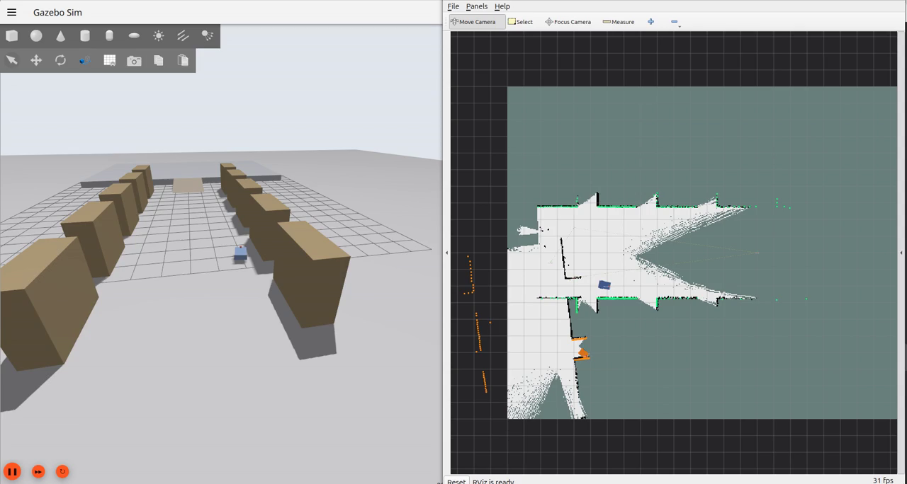
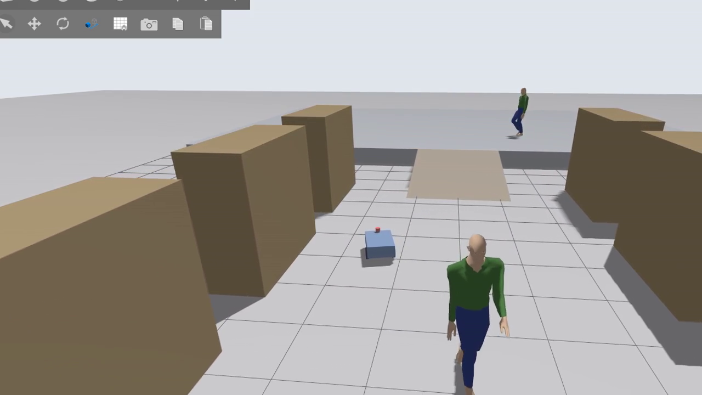
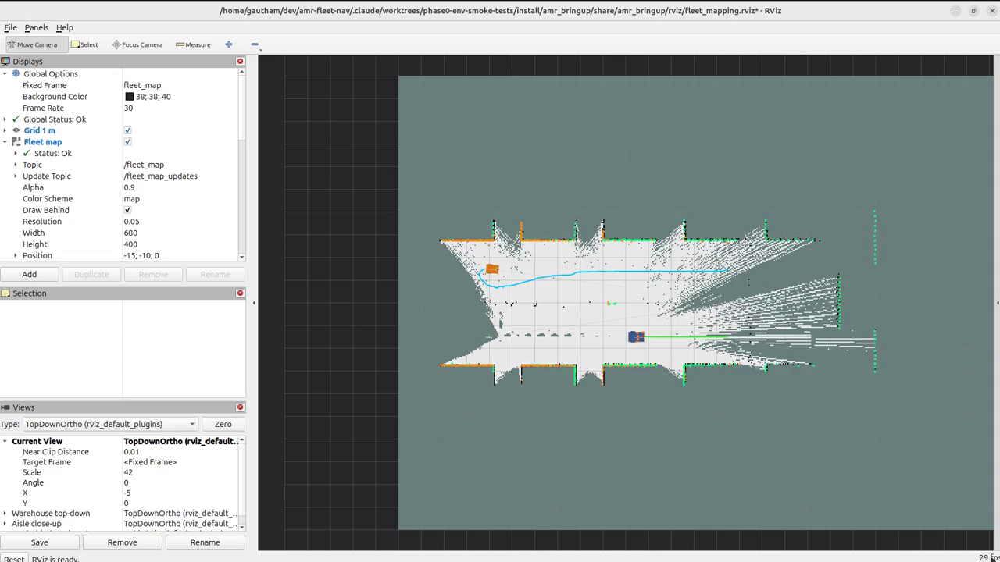

# How to Run — the evaluator's guide

Everything you need, in order. Each demo below tells you the **exact command**, what
**Gazebo** and **RViz** should show, how you know it **worked**, and what to check if
it did not.

- Per-scenario detail: [`docs/DEMO_RUNBOOK.md`](docs/DEMO_RUNBOOK.md)
- What was built and what was measured: [`README.md`](README.md)
- **Read [§9 Known failures](#9-known-failures-read-before-judging) before judging.**
  Two demos do not fully work and are listed there rather than hidden.

---

## 1. What you need

| | |
|---|---|
| OS | Ubuntu 24.04 |
| ROS | ROS 2 **Jazzy** |
| Simulator | Gazebo **Harmonic** (`gz-sim` 8) |
| Also | Nav2, `slam_toolbox`, `colcon`, `rviz2` |

Nothing else to install beyond dependencies.

---

## 2. Set up — four commands

```bash
git clone https://github.com/GauthamCodes/amr-fleet-nav.git
cd amr-fleet-nav
rosdep install --from-paths src --ignore-src -r -y
./ws.sh colcon build --symlink-install
```

**Expect:** `Summary: 9 packages finished`, **0 errors**. `setuptools` deprecation
warnings on stderr are normal.

```bash
./ws.sh python3 -m pytest tests/ -q      # expect: 241 passed
```

> ### If you already cloned this repo before, `git pull` is not enough
>
> **You must rebuild after pulling.** The launch files, the RViz configuration and
> the mission scripts all live in the `install/` tree, and a stale `install/` is
> indistinguishable from a broken project: `rviz:=true` is silently ignored, RViz
> never appears, and starting it by hand gives you an empty window. If a demo
> below does not behave as described, run this first:
>
> ```bash
> git pull
> ./ws.sh colcon build --symlink-install
> ```

### What is `./ws.sh`?

A wrapper every command here uses. It sources ROS and this workspace, points Gazebo
at the world files, and raises a CycloneDDS participant limit. **Use it for
everything, including `rviz2`.** Without it, the second robot's navigation servers
die with `Failed to find a free participant index for domain 0` — which looks like a
bug in the robot and is only the missing wrapper.

---

## 3. Before every demo

```bash
./scripts/clean_processes.sh
```

Wait for:

```
PROCESS TABLE CLEAN - nothing matching a simulation or ROS pattern is running
```

A leftover process from a previous run quietly corrupts the next one. This script
does **not** kill `rviz2` — if a stale RViz window is open, close it or run
`pkill -f rviz2`.

> **Nothing appears for the first ~30 seconds of any demo.** Startup is staged:
> robots spawn, then sensor validation, then SLAM, then the shared map, then
> navigation. Wait 45 s before concluding anything has hung.

---

## 4. Reading these demos

Every demo below is one command. Where a demo writes a report, it is given
`tag:=demo` so **your run cannot overwrite the committed evidence** in `results/`.

RViz, where it is used, starts automatically with the correct configuration. You do
not need to open it yourself.

---

### What a working run looks like

Captured from the verified runs described below, on the code in this repository.

| | |
|---|---|
|  | **The warehouse.** Rack rows either side, the ramp and upper plateau beyond, three walking pedestrians, and **both robots in the aisle** — AMR-2 amber on the left, AMR-1 blue on the right. This is what Gazebo should open to. |
|  | **Demo A, cooperative mapping.** Gazebo on the left, RViz on the right. `/fleet_map` covers the whole aisle with the rack bays cut out — built by both robots into one grid. |
|  | **Demo B, the safety override.** A pedestrian has walked into AMR-1's path and the robot has stopped short of them. |
|  | **Both routes planned at once.** Green is AMR-1's plan, cyan is AMR-2's, both in the `fleet_map` frame, `Global Status: Ok`. See §9.1 for what happens next. |

---

## Demo A — Cooperative mapping ⭐ start here

### Purpose
Two robots building **one shared map together** — the cooperative-mapping and
selective-map-update requirements.

### Command
```bash
./scripts/clean_processes.sh
./ws.sh ros2 launch amr_bringup fleet_survey.launch.py
```

### RViz
**Starts automatically.** Fixed Frame is already `fleet_map`.

### Expected startup
Gazebo opens looking **down the warehouse aisle**, with rack rows either side, the
ramp and upper plateau at the far end, and **both robots visible** — AMR-1 blue,
AMR-2 amber. RViz opens showing a mostly grey (unknown) `/fleet_map`,
`Global Status: Ok`.

### Expected behaviour
Both robots drive a lap of the aisle half a lap apart. The shared map fills in
**from both ends at once**, and rack bays appear as black cut-outs in the white free
space. In the terminal you will see the selective-update decisions live:

```
amr1: ACCEPT score=+0.371 (f=0.00 c=0.00 r=0.47 v=0.17) score >= 0.35
amr2: DEFER  score=+0.226 (f=0.02 c=0.12 r=0.22 v=0.26) score < 0.35
```

### Success condition
`/fleet_map` covers the whole aisle with both rack rows resolved, **and both robots
appear in the `ACCEPT` lines** — that is the proof both contributed, not just one.

### Common failure
RViz empty → your `install/` is stale; rebuild (§2). Grey everywhere after 60 s →
check `./ws.sh ros2 topic echo /fleet_map --once` returns a 680×400 grid.

**Takes:** 4–6 minutes. Stops itself.

**Verified:** the map grows from empty to covering the full aisle, and **both robots
appear in the `ACCEPT` stream of the same run** — that is the proof of cooperative
mapping, and it is what to check. **The per-run counts vary** and are not a result to
quote: three runs on the same command gave amr1/amr2 accepted counts of 41/38, 12/22
and 15/65, because the score depends on where each robot happens to be when a scan
lands. The figure to cite is the committed one in
`results/phase3_selective_updates.md` — **41 scored, 23 accepted, 18 deferred
(43.9 %)**, amr1 13/8 and amr2 10/10. This run's own artifact
(`results/fleet_survey_updates.md`) is git-ignored precisely so it cannot be mistaken
for that.

---

## Demo B — Safety override on a pedestrian

### Purpose
A dedicated safety layer that can stop the robot **even while Nav2 is still
commanding motion** — the dynamic-obstacle and safety requirements.

### Command
```bash
./scripts/clean_processes.sh
./ws.sh ros2 launch amr_bringup phase2_safety_run.launch.py headless:=false tag:=demo
```

> `tag:=demo` matters. Without it this run **overwrites** the committed
> `results/phase2_safety_suppressed.*`.

### RViz
**Not used.** This is a single-robot demo with no shared map, and the Gazebo view
shows everything. If you want RViz here anyway, set Fixed Frame to **`amr1/odom`**,
not `fleet_map`.

### Expected startup
Gazebo shows the aisle with AMR-1 and three walking pedestrians.

### Expected behaviour
AMR-1 drives up the aisle. A pedestrian walks into its path, the robot **stops short
of them**, and continues once they move away. **This happens three times.**

### Success condition
Three `HALT` lines in the terminal and `RESULT: PASS`:

```
HALT 1: clearance 0.797 m at 0.562 m/s, sensor->zero 4.0 ms
RELEASE: latch clearance 2.548 m > d_release 0.450 m
...
RESULT: PASS
```

Each halt shows the stopping rule `d_safe = k·v² + d_min` firing, the measured
clearance that violated it, and the time from laser reading to the zero command
being published.

### Common failure
`halts: 0` and `RESULT: FAIL` with `goal finished: REJECTED` in the log → stale
`install/`; rebuild (§2). The robot never drove, so no encounter ever happened.

**Takes:** 2–3 minutes. Stops itself.

**Verified:** 3 halts at 0.797 / 0.869 / 0.940 m clearance against a `d_safe` of
0.893 / 0.975 / 0.975 m; sensor→zero 4 / 10 / 11 ms; 0 commands leaked past the
latch; `RESULT: PASS`.

---

## Demo C — The whole system, running

### Purpose
Everything up at once: warehouse, both robots, sensor validation, SLAM, the shared
map, both navigation stacks, the motion chain, both safety gates, the traffic
controller.

### Command
```bash
./scripts/clean_processes.sh
./ws.sh ros2 launch amr_bringup fleet_nav.launch.py headless:=false rviz:=true
```

### RViz
**Starts automatically**, Fixed Frame `fleet_map`.

### Expected startup
Gazebo down the aisle with **both robots** and three pedestrians. RViz shows
`/fleet_map` (680×400 at 0.05 m, origin −15,−10), both robot models, both laser
scans.

### Expected behaviour
**The robots do not move — this demo sends no goals.** It exists to show the whole
graph standing up. Use Demo A or D to see motion.

### Success condition
In a second terminal:

```bash
./ws.sh ros2 node list | sort -u | wc -l     # expect 65
./ws.sh gz model --list | grep amr           # expect amr1 and amr2
./ws.sh ros2 run tf2_ros tf2_echo fleet_map amr1/base_link   # must resolve
```

> `ros2 node list` without `sort -u` prints **111**, not 65 — it repeats a node once
> per DDS participant. That is normal and is not two copies of anything.

### Common failure
RViz blank with `Frame [map] does not exist` → stale `install/` (§2). There is no
frame called `map` in this system; the shared frame is `fleet_map` and each robot's
own is `amrN/map`.

**Does not stop itself.** Ctrl-C when done.

**Verified:** 65 unique nodes, both robots in the Gazebo entity list, TF resolving
from `fleet_map` to both base links, `/fleet_map` latched at 680×400.

---

## Demo D — Two robots forced into a conflict (yielding)

### Purpose
Inter-robot traffic control: when two robots' paths conflict, one is made to wait.

### Command
```bash
./scripts/clean_processes.sh
./ws.sh ros2 launch amr_bringup phase7_yield.launch.py headless:=false rviz:=true tag:=demo
```

### RViz
**Starts automatically**, Fixed Frame `fleet_map`.

### Expected startup
Both robots, plus a barrier across the aisle with a single 3 m gap, so both must
pass through the same point.

### Expected behaviour
Both robots approach the gap; **AMR-2 stops, AMR-1 goes through, then AMR-2
continues.**

### Success condition
Three lines in the terminal:

```
conflict predicted amr1/amr2: ... - local layer has it
ESCALATED amr1/amr2: ... - amr2 yields to amr1
RELEASE amr2 after 15.2 s: conflict cleared ...
```

### Common failure
**No escalation at all is a legitimate outcome, not a failure.** The encounter is
staged and not identical every time — repeated runs have produced 3, 2, 1 and 0
yields. When the robots resolve it between themselves, the traffic controller
correctly does nothing and the report says `NOT EXERCISED`. If you want to see a
yield and this run does not produce one, run it again, or watch the recorded run at
[`media/yield_protocol.mp4`](media/yield_protocol.mp4).

**Takes:** 5–6 minutes. Stops itself.

---

## Demo E — Sensor validation rejecting impossible IMU data

### Purpose
A validation layer between the sensors and the navigation stack.

### Command
```bash
./scripts/clean_processes.sh
./ws.sh ros2 launch amr_bringup phase2_validation.launch.py mode:=imu_injection tag:=demo
```

### RViz
Not used — **the terminal output is the demonstration.**

### Expected behaviour
500 physically impossible IMU samples are injected and each one is rejected:

```
[WARN] imu REJECT (1): implausible angular velocity: |w_z| = 50.000 rad/s > 4.000 rad/s
```

### Success condition
All **500 rejected**, **0** reaching the validated topic, and the ~3 200 healthy
samples around them still **accepted** — it rejects the bad data without rejecting
everything.

**Takes:** ~2 minutes. Stops itself.

---

## Demo F — Payload-aware motion (produces a plot)

### Purpose
Acceleration and jerk limits that scale with load and differ per chassis, all from
one configuration file.

### Command
```bash
./scripts/clean_processes.sh
./ws.sh ros2 launch amr_bringup phase5_payload_trace.launch.py
```

### RViz
Not used. No Gazebo window needed.

### Success condition
Open `results/phase5_payload_trace.png`. The heavy robot becomes much more
conservative loaded (peak commanded acceleration 0.725 → 0.272 m/s², ×0.38) than the
light one does (1.112 → 0.940, ×0.85) — and no code treats the two robots
differently.

**Takes:** 3–4 minutes. Stops itself.

---

## 5. Using RViz by hand

You should not need to, but if you want to attach RViz to a already-running demo:

```bash
./ws.sh rviz2 -d src/amr_bringup/rviz/fleet_mapping.rviz --ros-args -p use_sim_time:=true
```

`./ws.sh` gives RViz the same environment as everything else · `-d` loads the saved
view · `use_sim_time:=true` makes it follow the simulator's clock — without it,
nothing appears.

### Fixed Frame

| demo | Fixed Frame |
|---|---|
| any two-robot demo (A, C, D) | **`fleet_map`** |
| any single-robot demo (B, ramp/laser demos) | **`amr1/odom`** |

**There is no frame called `map`.** A plain `rviz2` with no configuration defaults to
`map`, reports `Fixed Frame — Frame [map] does not exist`, and shows an empty
screen. That is the single most likely reason for a blank RViz.

The shared map is first published about **16 s** into a run, so an empty screen
before that is expected.

---

## 6. Where the results are

```bash
ls results/                                       # 78 evidence files
cat results/phase2_safety_suppressed.md           # the safety stops and their timing
cat results/phase3_selective_updates.md           # which map updates were kept or skipped
cat results/phase7_yield.md                       # the yield decisions
cat results/phase3_concurrent_goals_current.md    # what two goals do TODAY - read §9.1
cat results/phase3_concurrent_goals.md            # HISTORICAL - see §9.1 first
```

Short clips of real runs are in [`media/`](media/), each with its run report in
`media/run_reports/`.

---

## 7. Launch arguments

Consistent across every launch file that supports them:

| argument | meaning | where |
|---|---|---|
| `headless:=false` | show the Gazebo window | all |
| `rviz:=true` | start RViz already configured | `fleet_nav`, `fleet_survey` (default true), `phase3_fleet_goals`, `phase6_conflict`, `phase7_yield` |
| `with_actors:=true` | put the walking pedestrians in the warehouse | `fleet_nav`, `fleet_survey`, `phase3_fleet_goals` |
| `tag:=demo` | write this run's report under its own name | every launch that writes a report |

`rviz:=true` is **not** available on `phase1_*`, `phase2_*` or `phase5_*` — those are
single-robot or plot-producing runs.

---

## 8. If something goes wrong

| What you see | What it means | What to do |
|---|---|---|
| RViz never opens despite `rviz:=true` | stale `install/` — the argument does not exist in the old build | `./ws.sh colcon build --symlink-install` |
| RViz empty, `Frame [map] does not exist` | RViz is on its stock configuration | §5 — use the saved view, or set Fixed Frame |
| `Failed to find a free participant index for domain 0` | a command was run without `./ws.sh` | clean, relaunch through `./ws.sh` |
| `goal finished: REJECTED`, `t_goal 0.0` | goal sent before Nav2 activated — fixed in this build | rebuild (§2) |
| Gazebo opens on an empty floor | camera looking at the origin | fixed in this build; rebuild (§2) |
| No pedestrians | that demo has them off by default | add `with_actors:=true` |
| Nothing for 20–30 s | normal staged startup | wait 45 s |
| A goal ends `ABORTED` | see §9 | — |
| Results look inconsistent | leftover process | `./scripts/clean_processes.sh`, confirm the banner, rerun |

---

## 9. Known failures — read before judging

These are stated here rather than left for you to discover.

### 9.1 Two robots navigating to goals at once does not complete — `phase3_fleet_goals`

**Only one of the two robots reaches its goal.** The other plans a full path
repeatedly, never translates more than about 2 m, and `bt_navigator` aborts with
`Failed to make progress`. Which robot loses depends on the configuration:

| configuration | AMR-1 | AMR-2 |
|---|---|---|
| default | SUCCEEDED 18.8–19.5 s | ABORTED, ≤ 0.6 m driven |
| `with_motion_chain:=false` | ABORTED, 2.0 m | SUCCEEDED 11.6 s |

Reproduced in 9 consecutive runs, the most recent against a from-scratch build of this
commit — that run is committed as `results/phase3_concurrent_goals_current.md` (amr1
SUCCEEDED in 18.7 s having driven 10.52 m; amr2 ABORTED having driven 0.07 m). **Not**
caused by the pedestrians, the Gazebo GUI, the trajectory layer on its own, or the
safety gate — each was ruled out by running with it disabled.

`results/phase3_concurrent_goals.md` shows **both** robots succeeding at 18.8 s and
11.3 s. That artifact was measured before the payload motion chain and the fleet
trajectory layer existed, and **no run since reproduces it.** Whichever robot does
complete reproduces its own committed time almost exactly, so the numbers in that
file are real — but the configuration that produced them is not the configuration
that ships. **Treat that artifact as historical.**

This demo is therefore left out of the list above. To watch it anyway:

```bash
./ws.sh ros2 launch amr_bringup phase3_fleet_goals.launch.py \
    headless:=false rviz:=true tag:=demo
```

You will see both robots dispatched together, both plans drawn in RViz (green for
AMR-1, cyan for AMR-2), and one robot drive its route while the other does not.

### 9.2 Ramp / slope planning is partial

The terrain-cost mask loads correctly into both robots' global costmaps and the null
mask provably contributes nothing. But at a graded mask value the cost over the ramp
footprint comes out **identical to the null run**. Undiagnosed, and not claimed to
work.

### 9.3 Trajectory sharing (MAPF) is mechanism-level only

Each robot's predicted path provably becomes cost in the other's local costmap,
measured against a control run (layer on: 50/50 samples cost > 0; layer off: 0/59).
But the controller reacts to that cost by adjusting **speed** rather than steering
around it, so **robots autonomously deviating around each other is not
demonstrated.** Conflicts the robots cannot resolve are handled by the traffic
controller in Demo D.

### 9.4 Pedestrians are not physical

Gazebo actors are animated figures, not physics bodies. They are visible to the
laser and treated as obstacles, but cannot physically collide. Clearance is measured;
**"zero collisions" is never claimed.**

---

## 10. What is demonstrated

Cooperative mapping into one shared map · selective map updating · payload-dependent
acceleration limits · the safety override and its fail-closed behaviour · sensor
validation rejecting impossible IMU data · the yielding protocol · configuration-driven
fleet scaling · a modular nine-package workspace.

Partial or not demonstrated: §9.

---

## The video

The submission screenshare is delivered separately and is deliberately **not** stored
in this repository. It runs **3 min 22 s** and covers, in order: the warehouse and
both robots · cooperative mapping with `/fleet_map` growing live in RViz · the
selective-update result · concurrent goals, including the failure in §9.1 shown rather
than cut · payload-adaptive motion · the safety override stopping the robot on a
pedestrian · the yield protocol · IMU validation · the architecture and the
limitations above.

Every scene is real footage from a run of the commands on this page, except the yield,
which is the archived run in [`media/yield_protocol.mp4`](media/yield_protocol.mp4) and
is captioned as archived — three fresh attempts did not escalate, which is the
non-determinism §9 describes.
